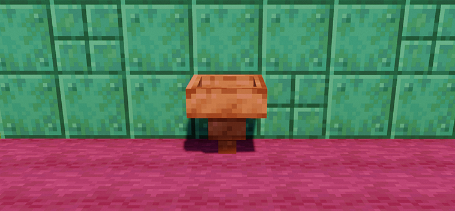
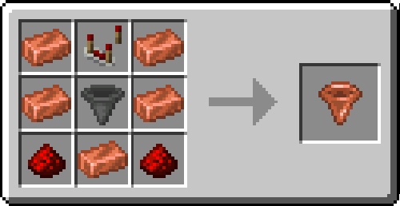
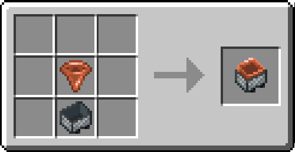
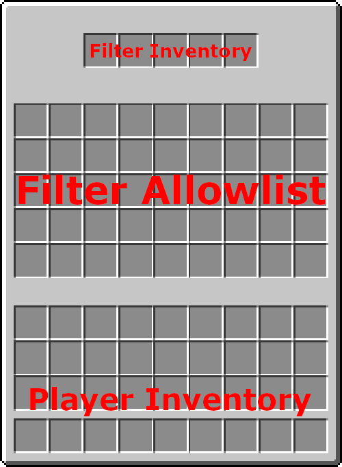
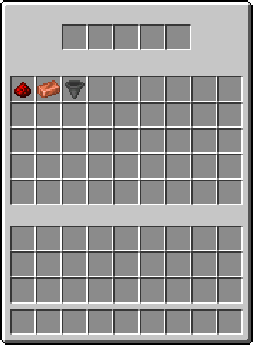

# The Filter Mod

## About

Filter is a very simple mod that adds... filters. They are just like regular hoppers but they can be used to only pull certain items.

## Crafting

  

## Using

The filter uses an allowlist to conditionally allow certain items to pass through. A filter with an empty allowlist will function as a regular hopper.

Adding items to the allowlist will make the filter only allow those items to pass through.

The above configuration will only allow redstone, hoppers, and copper ingots to pass through the filter.

## Special Mentions

Thank you to [MrCrayfish on GitHub](https://github.com/MrCrayfish)! The source code for MrCrayfish's [Golden Hopper mod](https://github.com/MrCrayfish/GoldenHopper) was used to create this mod.
